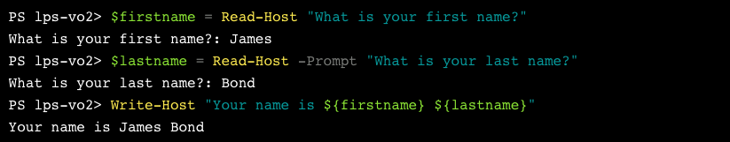

# PowerShell Notes

## Command syntax

CmdLets (pronounced command-lets) are given a Verb-Noun format. For example, `Write-Host`, `Get-Date`, `Set-ExecutionPolicy`, `New-Item` etc.

```ps1
# Verb-Noun format
Get-Command

Get-Command -Verb Get
Get-Command -Noun Host
```

- CmdLets, for the most part, are not case sensitive. `Get-Command -Noun Host` will get you the same results as `get-command -noun host`
- Screen can be cleared with `Clear-Host`, `cls` or `clear`
- Command history is available with `Get-History`


```ps1
# Get PowerShell version
$Host.version

# Get PowerShell version in extended details
$PSVersionTable
```

## Output to the screen

```ps1
Write-Host 'PowerShell is awesome'

# commas can be skipped for basic strings and if no variable/command substitution happening
Write-Host PowerShell is awesome

Write-Host "Today's date is $(Get-Date)" # Today's date is 10/18/2023 10:08:38
```

## Comments

```ps1
# This is a line comment

Write-Host 'Hello' # this is an inline comment

<# 
This is a block comment
There are multiple lines
#>
```

## Scripts

Script files (files with a bunch of commands in them) must use the extension `.ps1`

You can call a script with `./foo.ps1`

`./` means look in the current directory. On windows it will be `.\` while on Linux and macOS it will be `./`

## Variables 

- Variable names are NOT case-sensitive
- Can include spaces and special characters when enclosed in `{}`
- Convention is to use only alphanumeric characters and the `_` underscore

```ps1
# Variables
$name1 = 'Amna'
$name2 = 'Fazal'

# You can also define multiple variables in one go
$firstname, $lastname, $age = 'James', 'Bond', 42
```

## Outputting Variables and Strings

```ps1
# Output
# 1. no need to add spaces when directly writing with Write-Host
# spaces are auto-inserted
Write-Host $name1 'and' $name2 'are awesome!'
# Amna and Fazal are awesome!

# 2. Variable Substitution
# Requires double-quotes in order to evaluate variables
Write-Host "$name1 and $name2 are awesome!"
# Amna and Fazal are awesome!

$message = "$name1 and $name2 are awesome!"
Write-Host $message
# Amna and Fazal are awesome!

# 3. String Concatenation with +
$message = $name1 + ' and ' + $name2 + ' are awesome!'
Write-Host $message
# Amna and Fazal are awesome!

# 4. Format String
$message = '{0} and {1} are awesome!' -f $name1, $name2
Write-Host $message
# Amna and Fazal are awesome!

# Format Strings and String Concatenation can not be done
# directly in Write-Host
Write-Host $name1 + ' and ' + $name2 + ' are awesome!'
# Amna +  and  + Fazal +  are awesome!

Write-Host'{0} and {1} are awesome!' -f $name1, $name2
# ERROR: Write-Host : Cannot bind parameter 'ForegroundColor'. 
```

## Getting user input
You can get user input with `Read-Host`

```ps1
$name = Read-Host "What is your name?"

Write-Host "Greetings, $name!"
```



You can also obscure the input by marking it as a _secure string_. For example, passwords.

```ps1
$secret = Read-Host "Tell me a secret" -asSecureString

Write-Host $secret
# System.Security.SecureString
```


Create five files for the tasks

```ps1
1..5 | foreach { New-Item -Path task0$_.ps1 }
```

```
PS /home/user/powershell-4> 1..5 | foreach { New-Item -Path task0$_.ps1 }

    Directory: /home/user/powershell-4

UnixMode   User             Group                 LastWriteTime           Size Name
--------   ----             -----                 -------------           ---- ----
-rw-rw-r-- user             user               10/18/2023 08:41              0 task01.ps1
-rw-rw-r-- user             user               10/18/2023 08:41              0 task02.ps1
-rw-rw-r-- user             user               10/18/2023 08:41              0 task03.ps1
-rw-rw-r-- user             user               10/18/2023 08:41              0 task04.ps1
-rw-rw-r-- user             user               10/18/2023 08:41              0 task05.ps1
```