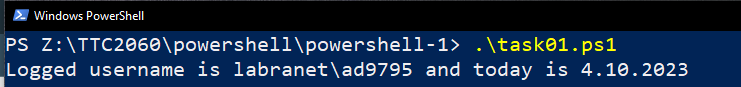
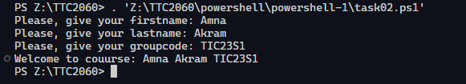
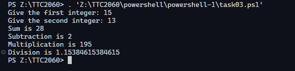
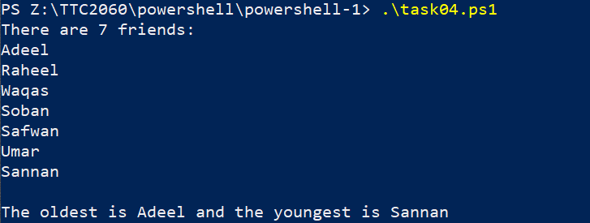
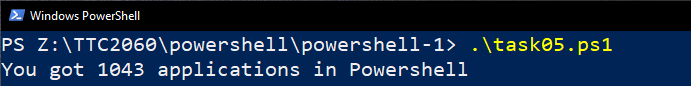

# PowerShell - Exercise 1

Task 01
---

Create a script that writes current logged username and current date to console.

Task 02
---

Ask from a user his/her `firstname`, `lastname` and `groupcode`. Save them to variables. After that show the following info in console.

Task 03
---

Ask two integers from a user, and return addition, subtraction, multiplication and division of numbers.

Task 04
---

Create an array named `$names`, that includes seven (7) names. You can select the names, they can be your friends or comic characters. Create a script that show how many items is in the array, show the items and also the first and last name of the array.

Task 05
---

PowerShell includes many kind of commands: alias, cmdlets, function and application. Create a script that counts how many application PowerShell returns. 

