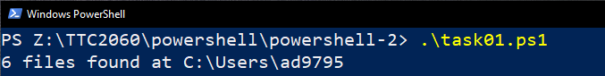
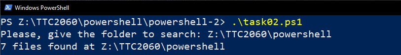
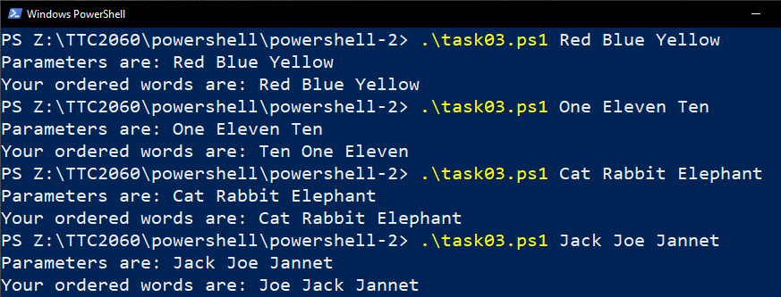
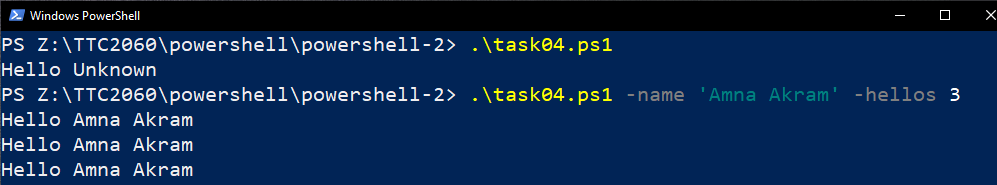
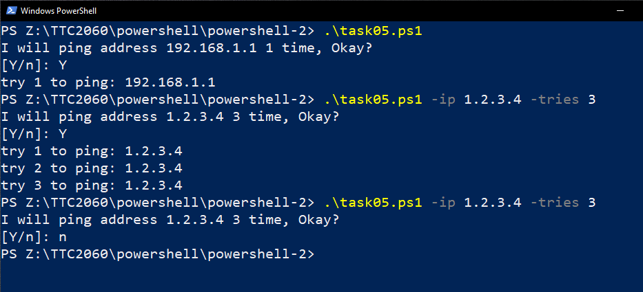

# PowerShell - Exercise 2

Task 01
---

Create a script that counts how many files are in user's home folder. The script shows the home folder name and the number of the files. 

Task 02
---

Create a script that counts how many files and folders are in given folder. The script shows the name of the folder and the number of the files.

Task 03
---

Create a script that takes three parameters, the type of the parameters is string. The script order the given strings by string length. Test your script at least with four different test runs, like in the picture.

Task 04
---

Create a script that takes two named parameters. The first parameter is the name of a user, second how many times the script greets the user. Give default values for the parameters, so if the script is run without arguments, it will say `Hello unknown` only once.

Task 05
---

Create a script that simulates pinging a remote server. It takes two named parameters. The first parameter is the IP-address of a server, second how many times the ping is tried. The script also ask the permission to make ping with. Pings are made only if a user says Yes. Give default values for the parameters, so if the script will be run without the arguments, it will try to ping `192.168.1.1` only once. Because `ping` is blocked in the labranet, we simulate only pinging.

