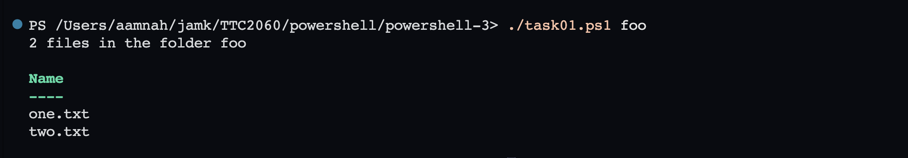
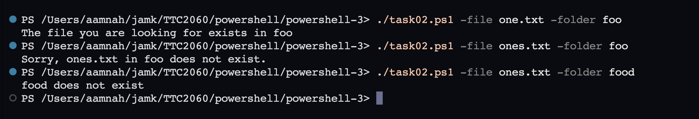
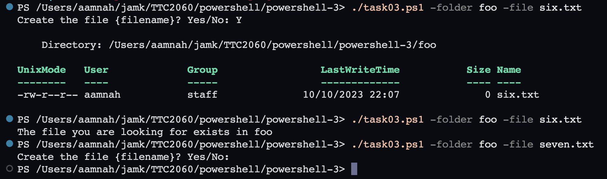
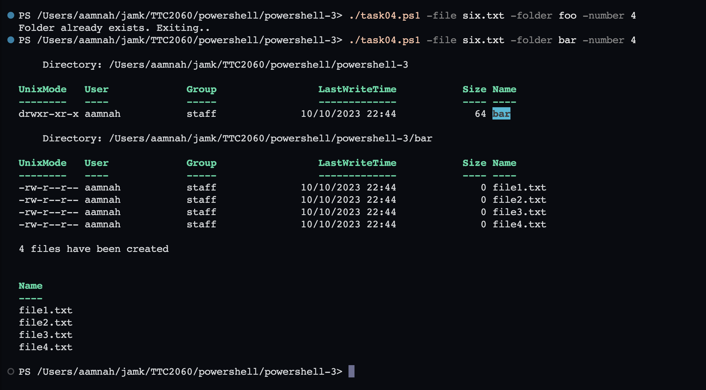
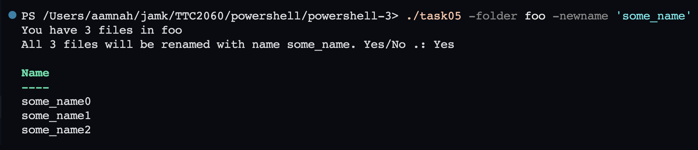

# [PowerShell - Exercise 3](https://ttc2060.pages.labranet.jamk.fi/Powershell/25-tasks/#powershell-3)

- [Conditions](https://ttc2060.pages.labranet.jamk.fi/Powershell/06-Conditions/)

Task 01
---
Create a script that takes one parameter: `foldername`. Check if the given folder exist. If the folder exist: show how many files are in the folder and then list the files of the folder. If the folder does not exist, the script will show a message: _Sorry, {foldername} does not exist._

Task 02
---

Create a script that takes two parameters: `foldername` and `filename`. Check first if the given folder exist. If the folder exists, check if the file exists in the folder. If true, show a proper message. If it does not exist, show a message: _"Sorry, {filename} in the {foldername} does not exist."_

Task 03
---

Create a script that takes two parameters: `foldername` and `filename`. Check first if the given file is in the given folder. If the file exists, show a proper message. If it does not exist, ask from a user _Create the file {filename}? Yes/No_. If the user returns "_Yes_", create the file to the folder.

Task 04
---

Create a script that takes three parameters: `foldername`, `filename` and `number`. Check first if the given folder, exists. If not, create the folder. After that create as many new files as the number argument says to the folder. Finally return a report how many files has been created, and list the names of the files.

Task 05
---

Create a script that takes two parameters: `foldername` and `newname`. Check first if the given folder, exists. If not, show a proper message and quit the script. If the folder exist, count files in the folder, and ask from a user: "_All {number} files will be renamed with name {newname}. Yes/No_". If the user returns "_Yes_", rename all files in the folder.

