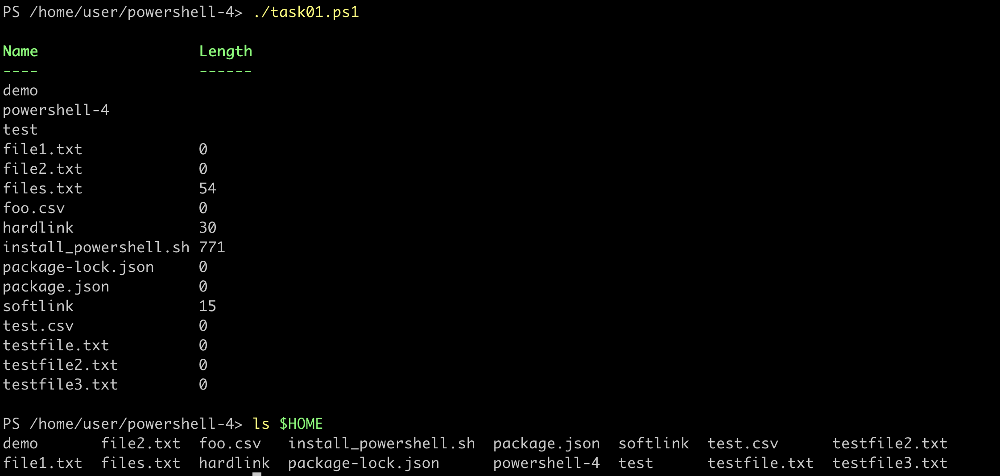
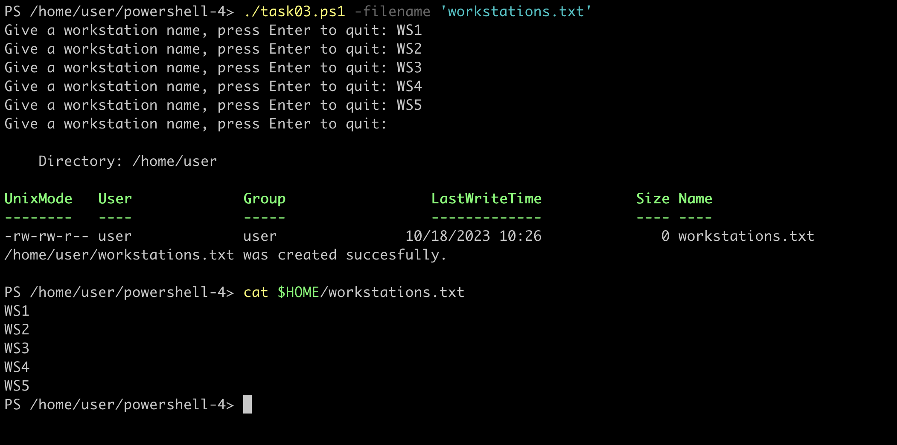

# [PowerShell - Exercise 4](https://ttc2060.pages.labranet.jamk.fi/Powershell/25-tasks/#powershell-4)

Task 01
---
Create a function named `Get-FileInfo` that shows Name and Length properties of all files in user's home folder. Run the function to prove that it works.

Task 02
---
Create a function named `Get-FileInfo2` that shows `Name`, `Length`, `LastWriteTime` properties of files with given extension in user's home folder. The extension is like `.txt` or `.csv`, and it has been given as a parameter. Run the function to prove that it works.

Task 03
---
Create a script that ask workstation names from an user. The names are asked until the user gives empty input. After that, the script writes all names to a file in user's home folder. The file name is given with the parameter: `filename`. Finally show a proper message that the file was created successfully.

Task 04
---
Create a script that ask file names from an user. The names are asked until the user gives empty input. After that, the script creates the files with given names to user's home folder. The script writes the current date and time to the files in the following format `30.9.2021 12.30`. Finally show a message that how many files were created successfully.

Task 05
---
Create a script that takes one parameter: `foldername`. First check that the given folder exist, then write all names of files in the folder to a text file named `files.txt`. Create the file to user's home folder. If the folder does not exist, the script will show a message: "_Sorry, {foldername} does not exist._"

