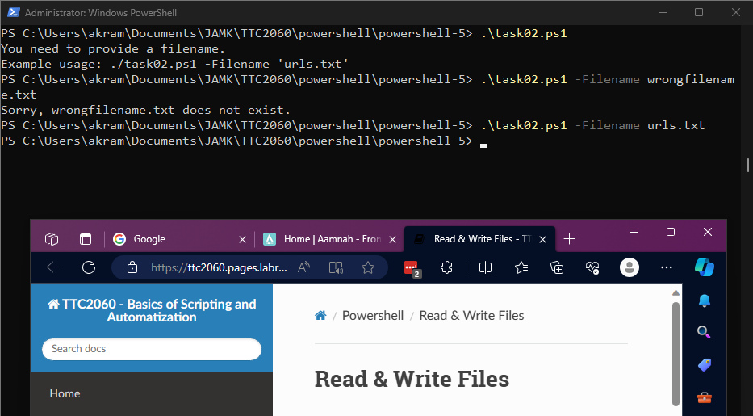
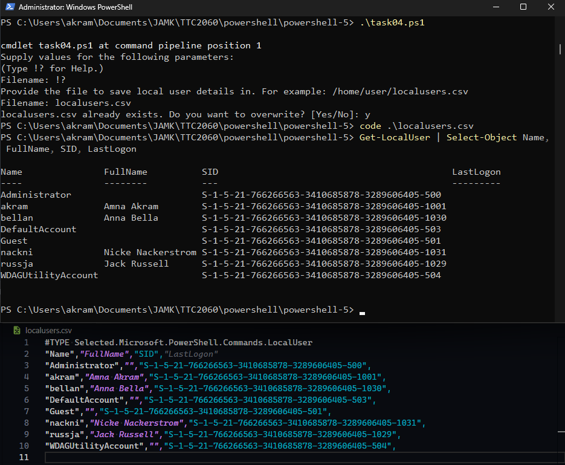

# [PowerShell - Exercise 5](https://ttc2060.pages.labranet.jamk.fi/Powershell/25-tasks/#powershell-5)

Task 01
---
Create a script that creates new accounts for a placebo system (placebo means here that the system not really exists). The script takes one parameter `filename`. The parameter points to a csv file including user names. Check first that the given file exist, then read all lines. User's account is created by taking first four characters of lastname and two characters of firstname. The account contains only lowercase letters. Give a message presented in the picture below. If the given file does not exist, the script will show an error message.

Task 02
---
Create a script that opens all the given urls to a browser. The script has one parameter `filename`. The parameter points to a text file where urls are. Check first that the given file exist, then read all lines and open the urls in a browser. If the given file does not exist, the script will show a error message.

Task 03
---
Create a script that creates new localusers by a given csv-file. The script has one parameter `filename`. Check first that the given file exist, then read all lines and create a new local user account for every user in file. The account name is created same way as in the task 01. You can use in this script the parameter `NoPassword`.

Please remember: you have to run this script with Administrator privileges that you can use the New-LocalUser cmdlet. If the given file does not exist, the script gives a proper error message.

Task 04
---
Create a script that writes information of all the local users in a computer to a CSV-file. The script has one parameter: `filename`. The information includes local users's 1) name 2) full name 3) SID and 4) lastlogon.

Task 05
---
In this task you have to create a new function called `Add-MyEvent`. The function takes two parameter: `Type` and `Message`. The type can be: `Error`, `Warning`, or `Information`. Message is a clear message. Add the following functionality to the task 04 using your new function.

- If the script can create a new CSV-file successfully, then it will add a Information message to the eventlog. 
- If the script cannot create a file successfully, then it adds a Error message to the eventlog.

Before using your new function create a new source named `MyPowerShell` to the Eventlog for writing your events.

