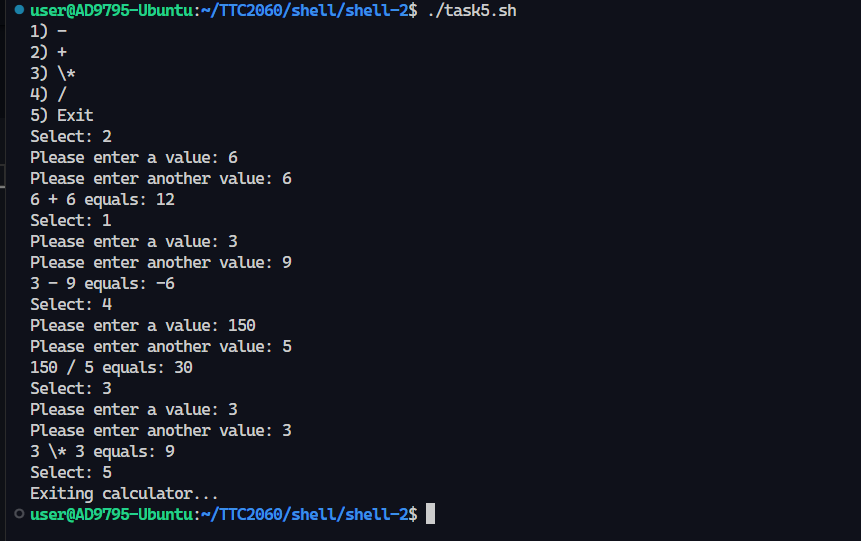

Related topics: 

- [If statement and tests](https://ttc2060.pages.labranet.jamk.fi/Shell/04.-Conditionals-and-tests/)
- [Loops](https://ttc2060.pages.labranet.jamk.fi/Shell/05.-Loops/)

## Task 1
Create a script that asks a file to remove from the user.

File is removed if it's a regular file and it's empty, otherwise some kind of error message is printed.

## Task 2
Write a shell script that checks if the file `/etc/hosts` exists.

If the file exists, script prints the outcome: /etc/hosts available.

Also check can you write in the file.

Script prints the outcome: You have permission to edit the file OR you don't have permission to edit the file

## Task 3
Create a script that returns a type of objects given (file or directory or something else).

User can give unlimited number of paths using the command line arguments.

Every object type is printed on the own line.

## Task 4
Create a script to automate user creation. NOTE: no password setup!

Script asks username from the user and before the user is created, script must check if the user with that name exists.

Use the following syntax in you conditional statement: `if id -u USERNAME`. 

If the user doesn't exist, conditional statement returns false (actual id command returns "no such user" / error code 1).

New user must have home directory under the `/home/` directory and default shell as bash.

Hint: User creation needs sudo permissions, how to execute script with it?

## Task 5
Create a script that mimics a simple calculator.

At first, script asks the operation from the user (`-`, `+`, `*`, `/` ). 

After the user selects operation, two values are asked and the outcome is printed to the user.

Script execution stops when the user selects "exit" operation.

