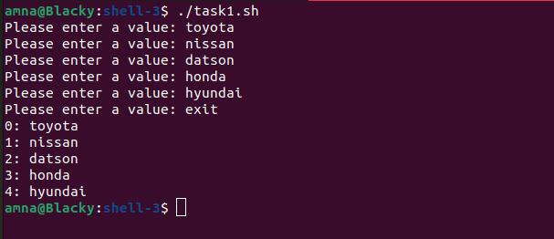
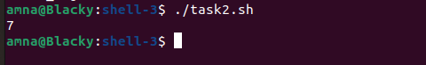
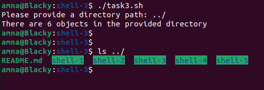
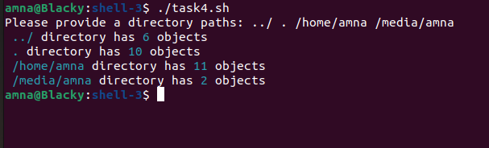
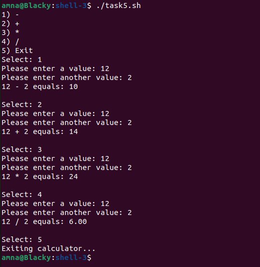

Related topics:

- [Arrays](https://ttc2060.pages.labranet.jamk.fi/Shell/06.-Arrays/)
- [Functions](https://ttc2060.pages.labranet.jamk.fi/Shell/07.-Functions/)

## Task 1
Create a script that asks values from the user until user types exit. All the values are saved in array. Finally script prints out the whole array (line by line) using the following syntax: `index: value`.

## Task 2
Create a script that prints a number of objects in the directory where you executed the script from.

Script must consist a function called `count_objects`. Function must have one local variable, that will hold the actual value, before it's printed to the user.

Hints: Function has a print functionality. `wc` command might be useful.

## Task 3
Modify Task 2.

Create a script that prints a number of objects in a **given directory** to the user. The path is asked from the user.

## Task 4
Modify Task 3.

User can give unlimited number of paths and given paths are saved in the **array**.

Function takes an array as an argument.

Hints: **read** commands options might be useful or some kind of loop.

## Task 5
Modify **Exercise set 2, Task 5** (Create a script that mimics a simple calculator).

Change the logic that all operations are calculated by using functions.

